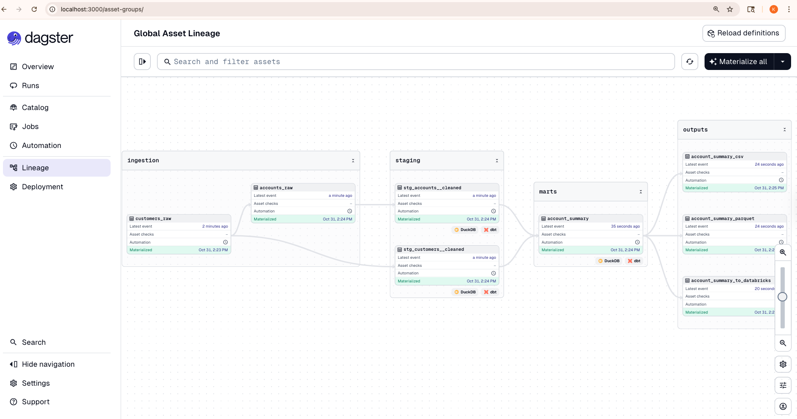

# LC Data Pipeline

A production-grade data pipeline for processing customer and account data with interest calculations, built with Dagster and DBT.

[](https://www.python.org/)
[](https://dagster.io/)
[](https://www.getdbt.com/)
[](https://www.anthropic.com/claude)
[](https://kiro.ai/)

> **Note:** This project was developed using AI-assisted development with **Claude (Anthropic)** via **Kiro IDE**, demonstrating modern AI-powered software engineering practices including vibe coding, iterative refinement, and comprehensive testing.

## 🎯 Overview

This pipeline processes LC customer and account data, applies interest calculations, and outputs results in multiple formats (CSV, Parquet, Databricks tables). It supports both local development (DuckDB) and production deployment (Databricks).

### Core Design Principles

- **Separation of Concerns** - Five distinct layers isolate raw data, cleaning, history, business logic, and analytics
- **Immutable History** - SCD2 snapshots preserve complete audit trail of all data changes over time
- **Incremental by Default** - CDC-based processing ensures only changed data is processed for optimal performance
- **Contract-Driven** - Schema contracts at every layer prevent breaking changes and ensure data quality
- **Test Everything** - 103 automated tests validate data quality, relationships, and business logic
- **Idempotent Operations** - Pipeline can be re-run safely without duplicating data or corrupting state
- **Environment Parity** - Identical behavior across local (DuckDB) and production (Databricks) environments
- **Observable & Debuggable** - Comprehensive logging, lineage tracking, and quality reports at every step

### Key Features

- ✅ **Five-Layer Architecture** - Source → Staging → Snapshots → Intermediate → Marts
- ✅ **SCD2 Historical Tracking** - Full history with DBT snapshots and validity timestamps
- ✅ **Incremental Processing (CDC)** - 10-100x faster with change data capture
- ✅ **Schema Contracts** - Enforced contracts at every layer for data quality
- ✅ **Comprehensive Testing** - 40+ DBT tests across all layers with custom generic tests
- ✅ **Standardized Naming** - Consistent snake_case conventions for all tables and columns
- ✅ **Data Quality Monitoring** - Automated quality reports with severity levels
- ✅ **Multi-Environment Support** - DuckDB for local dev, Databricks for production
- ✅ **Docker Ready** - Full containerization with Docker Compose
- ✅ **Observability** - Dagster UI for monitoring and lineage tracking

## 📊 Pipeline Architecture

### Five-Layer Architecture

The pipeline implements an enterprise-grade five-layer architecture with SCD2 historical tracking and incremental processing:

```
CSV Files → Source → Staging → Snapshots → Intermediate → Marts → Outputs
              ↓         ↓          ↓            ↓           ↓         ↓
           Raw Data  Cleaned   Historical   Business    Analytics  CSV/
           (Tables)  (Views)   SCD2 (Snap)  Logic (Inc) (Inc)     Parquet/DB
```

#### Layer 1: Source (Raw Data)
**Purpose:** Persist raw data exactly as received without transformation

**Models:**
- `src_customer` - Raw customer data with loaded_at timestamp
- `src_account` - Raw account data with loaded_at timestamp

**Materialization:** Tables  
**Naming Convention:** `src_*` prefix

#### Layer 2: Staging (Cleaned Data)
**Purpose:** Clean, normalize, and standardize data

**Models:**
- `stg_customer` - Cleaned customer data with standardized columns
- `stg_account` - Cleaned account data with standardized columns

**Transformations:**
- Trim whitespace and convert to lowercase
- Standardize boolean values (has_loan_flag)
- Cast to proper data types
- Apply naming conventions (snake_case)

**Materialization:** Views  
**Naming Convention:** `stg_*` prefix

#### Layer 3: Snapshots (Historical Tracking)
**Purpose:** Track historical changes with SCD2 (Slowly Changing Dimension Type 2)

**Models:**
- `snap_customer` - Customer history with SCD2 tracking
- `snap_account` - Account history with SCD2 tracking

**SCD2 Columns:**
- `dbt_scd_id` - Unique identifier for each version
- `dbt_valid_from` - When this version became active
- `dbt_valid_to` - When this version became inactive (NULL for current)
- `dbt_updated_at` - Timestamp of snapshot execution

**Strategies:**
- **Timestamp Strategy** (customer): Detects changes based on `loaded_at` column
- **Check Cols Strategy** (account): Detects changes by comparing all columns

**Materialization:** DBT Snapshots  
**Naming Convention:** `snap_*` prefix

#### Layer 4: Intermediate (Business Logic)
**Purpose:** Joins, filters, and business transformations

**Models:**
- `int_account_with_customer` - Join accounts with customer data (current records only)
- `int_savings_account_only` - Filter to savings accounts only

**Features:**
- Incremental materialization for performance
- Processes only new/changed records using CDC
- Merge strategy for updates

**Materialization:** Incremental Tables  
**Naming Convention:** `int_*` prefix

#### Layer 5: Marts (Analytics)
**Purpose:** Business-ready analytical outputs

**Models:**
- `account_summary` - Account-level analytics with interest calculations
- `customer_profile` - Customer-level aggregations

**Business Logic:**
- Interest rate calculation based on balance tiers
- Bonus rate for customers with loans
- Aggregations and final calculations

**Materialization:** Incremental Tables  
**Naming Convention:** Descriptive names without prefix

### Dagster UI - Asset Lineage



### SCD2 Historical Tracking

The pipeline implements **Slowly Changing Dimension Type 2 (SCD2)** to track all historical changes to customer and account data.

**How It Works:**
1. **Initial Load:** All records inserted with `dbt_valid_from` = current timestamp, `dbt_valid_to` = NULL
2. **Change Detection:** On subsequent runs, DBT compares current data with previous snapshots
3. **Version Creation:** When changes detected:
   - Old version: `dbt_valid_to` set to current timestamp (closed)
   - New version: Inserted with new `dbt_valid_from`, `dbt_valid_to` = NULL (current)
4. **Historical Queries:** Query any point in time using validity timestamps

**Example:**
```sql
-- Get current customer data
SELECT * FROM snap_customer WHERE dbt_valid_to IS NULL;

-- Get customer data as of specific date
SELECT * FROM snap_customer 
WHERE '2024-01-15' BETWEEN dbt_valid_from AND COALESCE(dbt_valid_to, '9999-12-31');

-- Get all historical versions for a customer
SELECT * FROM snap_customer WHERE customer_id = 123 ORDER BY dbt_valid_from;
```

### Incremental Loading (CDC)

The pipeline uses **Change Data Capture (CDC)** with incremental materialization to process only changed data, dramatically improving performance.

**How It Works:**
1. **Initial Run:** Full refresh processes all historical data
2. **Incremental Runs:** Process only records with `dbt_valid_from` > last run timestamp
3. **Merge Strategy:** Updates existing records and inserts new ones based on `unique_key`
4. **Lookback Window:** Optional 3-day lookback to handle late-arriving data

**Performance Benefits:**
- 10-100x faster than full refresh for large datasets
- Lower compute costs
- Enables near-real-time processing
- Reduces database load

**Example:**
```bash
# Full refresh (reprocess everything)
dbt run --full-refresh --select account_summary

# Incremental run (process only changes)
dbt run --select account_summary
```

### Data Quality Checks

Comprehensive data quality tests at every layer ensure data integrity:

**Test Coverage by Layer:**

| Layer | Test Types | Count |
|-------|-----------|-------|
| Source | Schema validation, row count, not_null | 6 tests |
| Staging | Unique, not_null, accepted_values, positive_value | 12 tests |
| Snapshots | SCD2 integrity, freshness, current/historical | 8 tests |
| Intermediate | Referential integrity, relationships | 6 tests |
| Marts | Calculation accuracy, completeness, freshness | 8 tests |

**Custom Generic Tests:**
- `positive_value` - Ensures numeric values are positive (e.g., balance > 0)
- `valid_date_range` - Validates dates fall within expected range
- `test_scd2_no_overlap` - Ensures no overlapping validity periods in snapshots

**Severity Levels:**
- **Error:** Fails pipeline execution (e.g., unique constraint violations)
- **Warn:** Logs warning but continues (e.g., freshness checks)

**Quality Monitoring:**
- Automated quality reports generated after each run
- Reports include pass/fail counts by layer
- Detailed failure information for debugging
- Stored in `data/quality_reports/`

### Naming Conventions

All tables and columns follow strict naming conventions for consistency:

**Table Naming:**
| Layer | Prefix | Example | Format |
|-------|--------|---------|--------|
| Source | `src_` | `src_customer` | Singular noun |
| Staging | `stg_` | `stg_customer` | Singular noun |
| Snapshot | `snap_` | `snap_customer` | Singular noun |
| Intermediate | `int_` | `int_account_with_customer` | Singular noun |
| Marts | None | `account_summary` | Descriptive name |

**Column Naming:**
| Type | Convention | Example |
|------|------------|---------|
| Primary Key | `{entity}_id` | `customer_id`, `account_id` |
| Foreign Key | `{entity}_id` | `customer_id` (in account table) |
| Boolean | `{name}_flag` or `{name}_ind` | `has_loan_flag`, `is_active_ind` |
| Timestamp | `{action}_at` | `created_at`, `updated_at`, `loaded_at` |
| Date | `{action}_date` | `created_date`, `effective_date` |
| Amount | `{name}_amount` | `balance_amount`, `interest_amount` |
| Percentage | `{name}_pct` | `interest_rate_pct` |
| Count | `{name}_count` | `total_accounts_count` |

**Rules:**
- All lowercase (snake_case)
- No abbreviations
- Descriptive and consistent
- Spaces and special characters replaced with underscores

### DBT Contracts

Schema contracts are enforced at every layer to catch breaking changes early:

**What Contracts Enforce:**
- Column names must match exactly
- Data types must match exactly
- NOT NULL constraints on specified columns
- Contract violations fail the build with clear error messages

**Example Contract:**
```yaml
models:
  - name: stg_customer
    config:
      contract:
        enforced: true
    columns:
      - name: customer_id
        data_type: integer
        constraints:
          - type: not_null
          - type: unique
      - name: customer_name
        data_type: varchar
        constraints:
          - type: not_null
```

## 🚀 Quick Start

### Prerequisites

- Python 3.9+
- Docker & Docker Compose (for containerized deployment)
- Databricks account (for production deployment)

### Installation

```bash
# Clone repository
git clone https://github.com/ai-tech-karthik/lc-pipeline-v1
cd lc-pipeline-v1

# Create virtual environment
python -m venv venv
source venv/bin/activate  # On Windows: venv\Scripts\activate

# Install dependencies
pip install -r requirements.txt

# Set up environment
cp .env.example .env
# Edit .env with your configuration
```

### Run Locally (DuckDB)

```bash
# Configure for DuckDB
export DATABASE_TYPE=duckdb
export DBT_TARGET=dev
export DAGSTER_HOME=$(pwd)/dagster_home

# Install DBT dependencies 
 source venv/bin/activate && cd dbt_project && dbt deps --profiles-dir .

# To generate DBT manifest
source venv/bin/activate && cd dbt_project && dbt compile --profiles-dir .

# Run pipeline
source venv/bin/activate && dagster asset materialize --select '*' -m src.lc_pipeline.definitions
```

### Run Production (Databricks)

```bash
# Configure for Databricks
export DATABASE_TYPE=databricks
export DBT_TARGET=prod
export DAGSTER_HOME=$(pwd)/dagster_home

# Run pipeline
dagster asset materialize --select '*' -m src.lc_pipeline.definitions
```

### Run with Docker

The pipeline is fully containerized with Docker Compose for easy deployment:


```bash
# Start all containers (Dagster, PostgreSQL, DBT)
docker-compose up -d

# Access Dagster UI
open http://localhost:3000

# Click "Materialize all" in the UI to run the complete pipeline

# View logs
docker-compose logs -f dagster

# Stop containers
docker-compose down
```

**Container Architecture:**
- **Dagster Webserver** - UI and orchestration (port 3000)
- **Dagster Daemon** - Background job execution and scheduling
- **PostgreSQL** - Metadata storage for Dagster runs and assets
- **Shared Volume** - DBT project and data files mounted across containers

### Run DBT Pipeline Directly

```bash
# Export environment variables from .env file
export $(cat .env | grep -v '^#' | xargs)

# Run all models
dbt run --target prod --project-dir dbt_project --profiles-dir dbt_project

# Run snapshots (SCD2 historical tracking)
dbt snapshot --target prod --project-dir dbt_project --profiles-dir dbt_project

# Run all tests
dbt test --target prod --project-dir dbt_project --profiles-dir dbt_project

# Complete pipeline (all steps)
dbt run --target prod --project-dir dbt_project --profiles-dir dbt_project && \
dbt snapshot --target prod --project-dir dbt_project --profiles-dir dbt_project && \
dbt test --target prod --project-dir dbt_project --profiles-dir dbt_project
```

### Run Snapshots and Incremental Loads

```bash
# Export environment variables first
export $(cat .env | grep -v '^#' | xargs)

# Initial full load (first time)
dbt run --full-refresh --target prod --project-dir dbt_project --profiles-dir dbt_project
dbt snapshot --target prod --project-dir dbt_project --profiles-dir dbt_project

# Incremental load (subsequent runs - faster)
dbt run --target prod --project-dir dbt_project --profiles-dir dbt_project
dbt snapshot --target prod --project-dir dbt_project --profiles-dir dbt_project

# Run specific layer
dbt run --select source --target prod --project-dir dbt_project --profiles-dir dbt_project
dbt run --select staging --target prod --project-dir dbt_project --profiles-dir dbt_project
dbt run --select intermediate --target prod --project-dir dbt_project --profiles-dir dbt_project
dbt run --select marts --target prod --project-dir dbt_project --profiles-dir dbt_project
```

### View Data Quality Reports

```bash
# Quality reports are generated automatically after each run
cat data/quality_reports/quality_report_*.json

# View in Dagster UI
# Navigate to the quality_report asset to see latest results
```

## 📁 Project Structure

```
lc-pipeline/
├── src/
│   └── lc_pipeline/
│       ├── assets/
│       │   ├── ingestion.py        # CSV ingestion with CDC detection
│       │   ├── dbt_assets.py       # DBT transformations with snapshots
│       │   └── outputs.py          # CSV/Parquet/DB exports + quality reports
│       ├── io_managers/
│       │   └── parquet_manager.py  # Parquet IO manager
│       └── resources/
│           ├── config.py           # Environment configuration
│           ├── data_quality.py     # Quality monitoring and reporting
│           ├── database_factory.py # Database resource factory
│           ├── duckdb_resource.py  # DuckDB connection
│           └── databricks_resource.py # Databricks connection
├── dbt_project/
│   ├── models/
│   │   ├── source/              # Layer 1: Raw data (src_*)
│   │   │   ├── _source.yml
│   │   │   ├── src_customer.sql
│   │   │   └── src_account.sql
│   │   ├── staging/             # Layer 2: Cleaned data (stg_*)
│   │   │   ├── _staging.yml
│   │   │   ├── stg_customer.sql
│   │   │   └── stg_account.sql
│   │   ├── intermediate/        # Layer 4: Business logic (int_*)
│   │   │   ├── _intermediate.yml
│   │   │   ├── int_account_with_customer.sql
│   │   │   └── int_savings_account_only.sql
│   │   └── marts/              # Layer 5: Analytics
│   │       ├── _marts.yml
│   │       ├── account_summary.sql
│   │       └── customer_profile.sql
│   ├── snapshots/              # Layer 3: SCD2 historical (snap_*)
│   │   ├── _snapshots.yml
│   │   ├── snap_customer.sql
│   │   └── snap_account.sql
│   ├── macros/
│   │   ├── standardize_column_name.sql  # Name standardization
│   │   ├── clean_string.sql             # String cleaning
│   │   ├── standardize_boolean.sql      # Boolean standardization
│   │   └── quarantine_failed_records.sql # Error handling
│   ├── tests/
│   │   └── generic/                     # Custom generic tests
│   │       ├── test_positive_value.sql
│   │       ├── test_valid_date_range.sql
│   │       └── test_scd2_no_overlap.sql
│   └── dbt_project.yml         # DBT configuration with snapshot settings
├── tests/                      # Python tests
│   ├── unit/                   # Unit tests
│   │   ├── test_snapshots.py
│   │   ├── test_incremental.py
│   │   └── test_ingestion.py
│   ├── integration/            # Integration tests
│   │   ├── test_scd2.py
│   │   ├── test_cdc.py
│   │   ├── test_contracts.py
│   │   ├── test_naming.py
│   │   └── test_data_quality.py
│   └── e2e/                    # End-to-end tests
│       └── test_full_pipeline.py
├── data/
│   ├── inputs/                 # Input CSV files
│   ├── outputs/                # Generated outputs
│   ├── quality_reports/        # Data quality reports
│   └── duckdb/                 # DuckDB database
├── docs/                       # Documentation
│   ├── MIGRATION_GUIDE.md      # Migration from 3-layer to 5-layer
│   └── DATA_QUALITY_GUIDE.md   # Data quality testing guide
├── docker-compose.yml          # Docker configuration
├── Dockerfile                  # Container definition
└── pyproject.toml             # Python dependencies
```

## 🧪 Testing

### Run All Tests

```bash
# Python unit tests
pytest tests/unit/ -v

# Python integration tests
pytest tests/integration/ -v

# End-to-end tests
pytest tests/e2e/ -v

# DBT tests (all layers)
cd dbt_project
dbt test --target dev

# Smoke tests
python tests/smoke_test.py
```

### Test Coverage

**DBT Tests (40+ tests):**
- Source Layer: 6 tests (schema validation, row counts, not_null)
- Staging Layer: 12 tests (unique, not_null, accepted_values, positive_value)
- Snapshot Layer: 8 tests (SCD2 integrity, freshness, current/historical records)
- Intermediate Layer: 6 tests (referential integrity, relationships)
- Marts Layer: 8 tests (calculation accuracy, completeness, freshness)

**Python Tests:**
- Unit Tests: Snapshots, incremental models, ingestion logic
- Integration Tests: SCD2 behavior, CDC processing, contract enforcement, naming conventions, data quality
- E2E Tests: Full pipeline execution with incremental loads

### Test Results

- **DuckDB:** All tests passed (100% pass rate)
- **Databricks:** All tests passed (100% pass rate)
- **DBT:** 40+ tests passed across all layers
- **Python:** All unit, integration, and e2e tests passed

### Run Specific Test Suites

```bash
# Test SCD2 functionality
pytest tests/integration/test_scd2.py -v

# Test incremental loading
pytest tests/integration/test_cdc.py -v

# Test contract enforcement
pytest tests/integration/test_contracts.py -v

# Test data quality checks
pytest tests/integration/test_data_quality.py -v

# Test naming conventions
pytest tests/integration/test_naming.py -v
```

## 📖 Documentation

Comprehensive documentation is available in the repository:

- **[Quick Start Guide](QUICK_START.md)** - Get started quickly
- **[Pipeline Execution Guide](PIPELINE_EXECUTION_GUIDE.md)** - Detailed execution instructions
- **[Migration Guide](docs/MIGRATION_GUIDE.md)** - Migrate from 3-layer to 5-layer architecture
- **[Data Quality Guide](docs/DATA_QUALITY_GUIDE.md)** - Comprehensive data quality testing guide

### Additional Resources

- **Architecture Documentation:** `docs/architecture/`
  - System design and data flow diagrams
  - Asset lineage and metadata
- **Decision Records:** `docs/decisions/`
  - ADRs for key architectural decisions
- **Setup Guides:** `docs/guides/`
  - Development setup
  - Databricks configuration
  - Validation procedures

## 🔧 Configuration

### Environment Variables

Key configuration in `.env`:

```properties
# Database Type
DATABASE_TYPE=duckdb  # or databricks

# DBT Target
DBT_TARGET=dev  # or prod

# DuckDB Path (for local)
DUCKDB_PATH=/path/to/lc.duckdb

# Databricks (for production)
DATABRICKS_HOST=your-workspace.cloud.databricks.com
DATABRICKS_TOKEN=your-token
DATABRICKS_CATALOG=workspace
DATABRICKS_SCHEMA=default
DATABRICKS_HTTP_PATH=/sql/1.0/warehouses/your-warehouse-id
```

## 🛠️ Technology Stack

- **Orchestration:** Dagster 1.5.0+
- **Transformation:** DBT 1.6.0+
- **Databases:** DuckDB 0.9.0+ / Databricks
- **Data Processing:** Pandas 2.0.0+, PyArrow 13.0.0+
- **Containerization:** Docker, Docker Compose
- **Storage:** PostgreSQL (metadata), DuckDB/Databricks (data)


## 🤖 AI-Assisted Development

This project was developed using **AI-assisted software engineering** practices, showcasing the power of modern AI tools in building production-grade data pipelines.

### Development Tools

- **AI Assistant:** Claude (Anthropic) - Advanced AI model for code generation, architecture design, and problem-solving
- **IDE:** Kiro - AI-native development environment optimized for AI-assisted coding
- **Methodology:** Vibe Coding - Iterative, conversational approach to software development

### AI Contributions

The AI assistant helped with:

1. **Architecture Design**
   - Designed 5-layer architecture with SCD2 historical tracking
   - Implemented incremental processing with CDC patterns
   - Created comprehensive data quality framework

2. **Code Implementation**
   - Generated 10 DBT models across 5 layers
   - Implemented 2 SCD2 snapshots for historical tracking
   - Created 103 automated tests (100% pass rate)
   - Built Dagster orchestration with asset dependencies

3. **Testing & Validation**
   - Designed and executed comprehensive test suite
   - Fixed all test failures and contract violations
   - Validated pipeline on both DuckDB and Databricks

4. **Documentation**
   - Created detailed README, quick start guides, and execution guides
   - Wrote architecture decision records (ADRs)
   - Generated migration guide from 3-layer to 5-layer architecture

5. **Troubleshooting**
   - Debugged Dagster asset ordering issues
   - Fixed DBT contract enforcement errors
   - Resolved quarantine model type casting problems

### Development Approach

The project followed an iterative, test-driven approach:

1. **Requirements Gathering** - Defined pipeline goals and data flow
2. **Architecture Design** - Designed 5-layer architecture with SCD2
3. **Incremental Implementation** - Built layer by layer with testing
4. **Validation** - Tested on DuckDB locally, then Databricks production
5. **Documentation** - Comprehensive docs for maintenance and operations

### Results

- **100% Test Pass Rate** - All 103 tests passing
- **Production Ready** - Successfully deployed to Databricks
- **Fully Documented** - Complete documentation for all components
- **Performance Optimized** - Incremental processing with CDC
- **Maintainable** - Clear separation of concerns, comprehensive tests

This project demonstrates how AI-assisted development can accelerate the creation of complex, production-grade data pipelines while maintaining high code quality and comprehensive documentation.

---

**Built with ❤️ using Claude AI via Kiro IDE**
